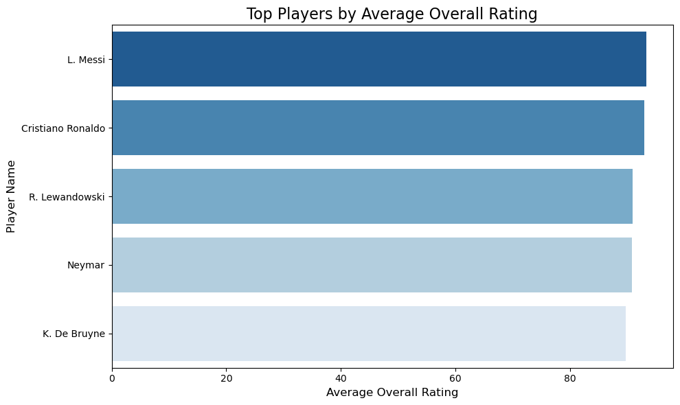
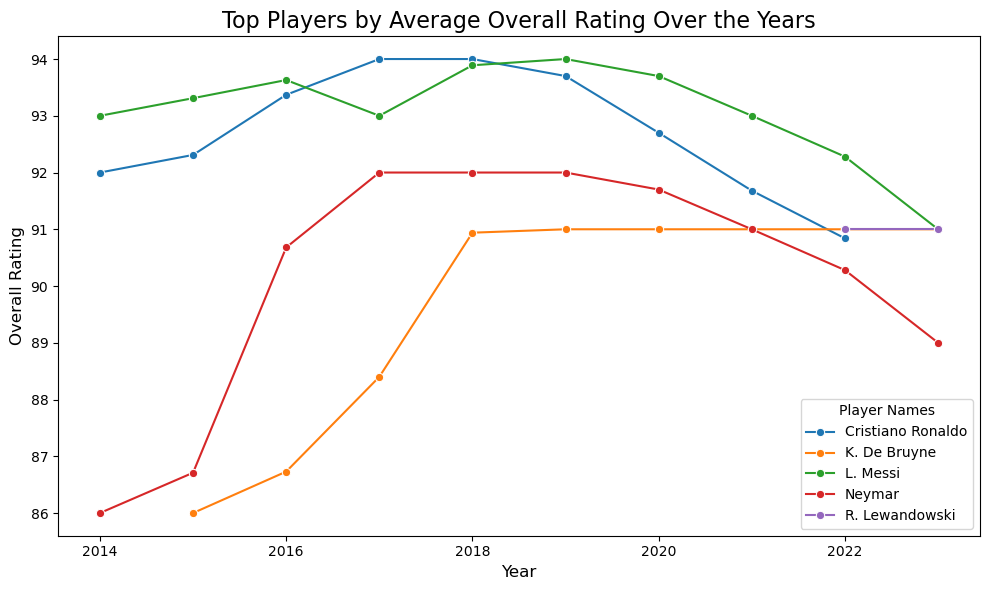
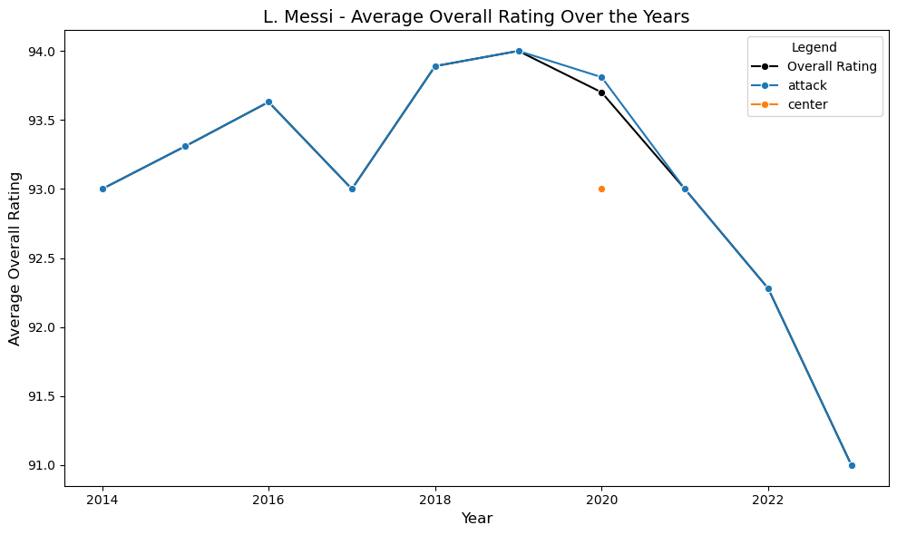
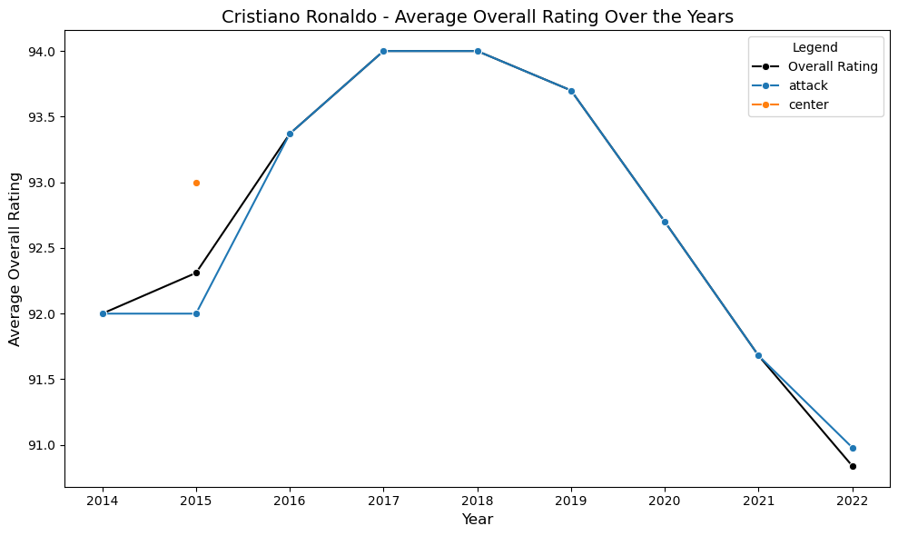
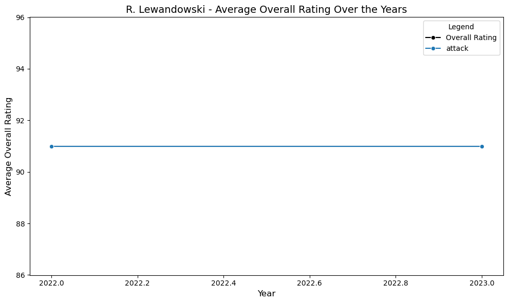
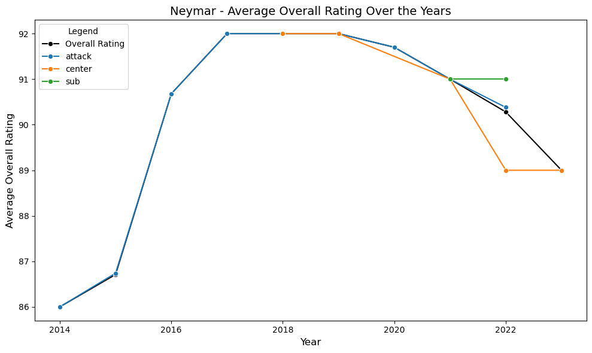
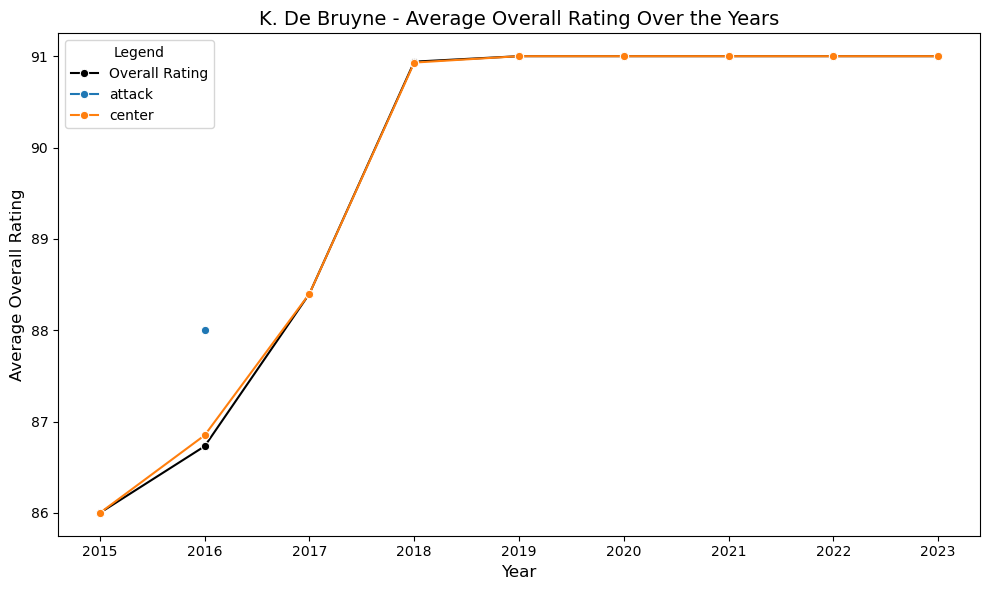
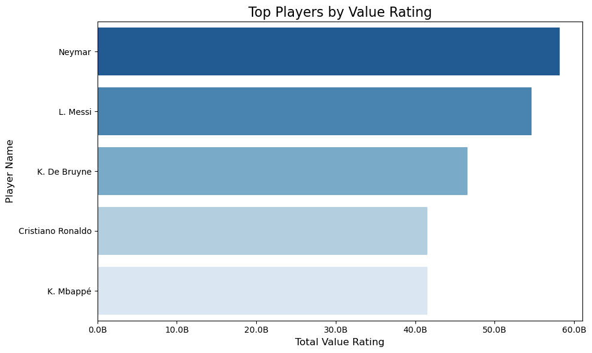

# Fifa 2023 Complete Player Dataset

## Set Path Datasets


```python
%load_ext autoreload
%autoreload 2

%load_ext sql
```


```python
import os
import sys
import time
import warnings

import pandas as pd

setPath = os.path.join(os.getenv('LinkPaths'), 'arrowSEnvs')
if setPath not in sys.path: sys.path.append(setPath)

from setupEnv import setupEnv
setupEnv.setPaths()
arrowDb = setupEnv.pathAt.get('path1')
dataset = setupEnv.pathAt.get('dataset')
database = setupEnv.pathAt.get('database')

import arrowDb
from arrowDb.sets import SetPathFiles # type: ignore

datasetLists = SetPathFiles.list_files_path(dataset,'csv', getr=True)
FIFA23ConnDb = arrowDb.JunctDbase('duckdb',conn_typesub='duckdb',
                        file_dbase='fifa23completeplayer.duckdb',
                        folder_path=database)
databaseLists = SetPathFiles.list_files_path(database,'duckdb', getp=False)
os.environ['FIFA23ddbStr'] = FIFA23ConnDb.conn('conn string')
# %sql $FIFA23ddbStr
```


<hr style="width: 60%; margin-left: 0; border: none; border-top: 1px solid black; margin-bottom: 0;">


    Files in path folder (extensions: csv):
    


<hr style="width: 60%; margin-left: 0; border: none; border-bottom: 1px solid black; margin-top: 0;">


    female_coaches.csv 0.01MB (5.23e+00 KB)
    female_players.csv 89.85MB (9.20e+04 KB)
    female_players_legacy.csv 1.61MB (1.65e+03 KB)
    female_teams.csv 2.11MB (2.16e+03 KB)
    male_coaches.csv 0.13MB (1.30e+02 KB)
    male_players.csv 5.25 GB (5.50e+06 KB)
    male_players_legacy.csv 86.72MB (8.88e+04 KB)
    male_players_output.csv 5.22 GB (5.48e+06 KB)
    male_teams.csv 107.52MB (1.10e+05 KB)
    


<hr style="width: 80%; margin-left: 0; border: none; border-top: 2px solid black; margin-bottom: 2px;"><hr style="width: 80%; margin-left: 0; border: none; border-bottom: 1px solid black; margin-top: 0;">


    Instance of the object has been created.
    Connection (duckdb) to 'fifa23completeplayer.duckdb' database, 'Open Connection' Successfully.
    


<hr style="width: 80%; margin-left: 0; border: none; border-top: 1px solid black; margin-bottom: 2px;"><hr style="width: 80%; margin-left: 0; border: none; border-bottom: 2px solid black; margin-top: 0;">


<hr style="width: 60%; margin-left: 0; border: none; border-bottom: 1px solid black; margin-top: 0;">


## Import data to table DuckDB database

### table 'male_players'

#### List File database in dataset path


```python
SetPathFiles.list_files_path(database,'duckdb')
```


<hr style="width: 60%; margin-left: 0; border: none; border-top: 1px solid black; margin-bottom: 0;">


    Files in path folder (extensions: duckdb):
    


<hr style="width: 60%; margin-left: 0; border: none; border-bottom: 1px solid black; margin-top: 0;">


    fifa23completeplayer.duckdb 0.01MB (1.20e+01 KB)
    


<hr style="width: 60%; margin-left: 0; border: none; border-bottom: 1px solid black; margin-top: 0;">


#### Import 'male_players.csv' in to 'male_players', 'fifa23completeplayer.duckdb' Database


```python
FIFA23ConnDb.query(
    'import file to db',
    path=dataset,
    file='male_players.csv',
    file_type='csv')
```


<hr style="width: 80%; margin-left: 0; border: none; border-top: 1px solid black; margin-bottom: 0;">


    File 'male_players.csv'(5.25 GB) to import into 'fifa23completeplayer.duckdb' database file, start...
    


    FloatProgress(value=0.0, layout=Layout(width='auto'), style=ProgressStyle(bar_color='black'))


    File 'male_players.csv' has been successfully imported into table 'male_players'
    Time taken: 100.78 seconds
    Peak memory: 7.27 GB
    Average memory: 204.66 MB
    Total rows and columns: (10003590, 110)
    


<hr style="width: 80%; margin-left: 0; border: none; border-bottom: 1px solid black; margin-top: 0;">


```python
SetPathFiles.list_files_path(database,'duckdb')
```


<hr style="width: 60%; margin-left: 0; border: none; border-top: 1px solid black; margin-bottom: 0;">


    Files in path folder (extensions: duckdb):
    


<hr style="width: 60%; margin-left: 0; border: none; border-bottom: 1px solid black; margin-top: 0;">


    fifa23completeplayer.duckdb 1.53 GB (1.60e+06 KB)
    


<hr style="width: 60%; margin-left: 0; border: none; border-bottom: 1px solid black; margin-top: 0;">


```python
FIFA23ConnDb.query("object list")
```


<hr style="width: 60%; margin-left: 0; border: none; border-top: 1px solid black; margin-bottom: 0;">


    List for 'table' in 'fifa23completeplayer.duckdb' database:
    - male_players (table object)
    


<hr style="width: 60%; margin-left: 0; border: none; border-bottom: 1px solid black; margin-top: 0;">


<hr style="width: 60%; margin-left: 0; border: none; border-top: 1px solid black; margin-bottom: 0;">


    List for 'view' in 'fifa23completeplayer.duckdb' database:
    - [Null] No view object in list
    


<hr style="width: 60%; margin-left: 0; border: none; border-bottom: 1px solid black; margin-top: 0;">


#### 'male_players' table description


```python
FIFA23ConnDb.query('table description',
                        table='male_players',
                        columns='column_name,\
                        ordinal_position,\
                        data_type,\
                        is_nullable')
```


<hr style="width: 80%; margin-left: 0; border: none; border-top: 2px solid black; margin-bottom: 2px;"><hr style="width: 80%; margin-left: 0; border: none; border-bottom: 1px solid black; margin-top: 0;">


    Description for 'male_players'
    


<hr style="width: 80%; margin-left: 0; border: none; border-top: 2px solid black; margin-bottom: 2px;"><hr style="width: 80%; margin-left: 0; border: none; border-bottom: 1px solid black; margin-top: 0;">


<div>
<table border="1" class="dataframe">
  <thead>
    <tr style="text-align: right;">
      <th></th>
      <th>column_name</th>
      <th>ordinal_position</th>
      <th>data_type</th>
      <th>is_nullable</th>
    </tr>
  </thead>
  <tbody>
    <tr>
      <th>1</th>
      <td>player_id</td>
      <td>1</td>
      <td>BIGINT</td>
      <td>YES</td>
    </tr>
    <tr>
      <th>2</th>
      <td>player_url</td>
      <td>2</td>
      <td>VARCHAR</td>
      <td>YES</td>
    </tr>
    <tr>
      <th>3</th>
      <td>fifa_version</td>
      <td>3</td>
      <td>BIGINT</td>
      <td>YES</td>
    </tr>
    <tr>
      <th>4</th>
      <td>fifa_update</td>
      <td>4</td>
      <td>BIGINT</td>
      <td>YES</td>
    </tr>
    <tr>
      <th>5</th>
      <td>fifa_update_date</td>
      <td>5</td>
      <td>DATE</td>
      <td>YES</td>
    </tr>
    <tr>
      <th>...</th>
      <td>...</td>
      <td>...</td>
      <td>...</td>
      <td>...</td>
    </tr>
    <tr>
      <th>106</th>
      <td>cb</td>
      <td>106</td>
      <td>VARCHAR</td>
      <td>YES</td>
    </tr>
    <tr>
      <th>107</th>
      <td>rcb</td>
      <td>107</td>
      <td>VARCHAR</td>
      <td>YES</td>
    </tr>
    <tr>
      <th>108</th>
      <td>rb</td>
      <td>108</td>
      <td>VARCHAR</td>
      <td>YES</td>
    </tr>
    <tr>
      <th>109</th>
      <td>gk</td>
      <td>109</td>
      <td>VARCHAR</td>
      <td>YES</td>
    </tr>
    <tr>
      <th>110</th>
      <td>player_face_url</td>
      <td>110</td>
      <td>VARCHAR</td>
      <td>YES</td>
    </tr>
  </tbody>
</table>
<p>110 rows × 4 columns</p>
</div>


    The table result display in 'DataFrame'
    Total rows and columns: (110, 4)
    


<hr style="width: 80%; margin-left: 0; border: none; border-top: 1px solid black; margin-bottom: 2px;"><hr style="width: 80%; margin-left: 0; border: none; border-bottom: 2px solid black; margin-top: 0;">


#### Preview 'male_players' table


```python
FIFA23ConnDb.query('show table',view='male_players',nrows=5)
```


<hr style="width: 80%; margin-left: 0; border: none; border-top: 2px solid black; margin-bottom: 2px;"><hr style="width: 80%; margin-left: 0; border: none; border-bottom: 1px solid black; margin-top: 0;">


<div>
<table border="1" class="dataframe">
  <thead>
    <tr style="text-align: right;">
      <th></th>
      <th>player_id</th>
      <th>player_url</th>
      <th>fifa_version</th>
      <th>fifa_update</th>
      <th>fifa_update_date</th>
      <th>short_name</th>
      <th>long_name</th>
      <th>player_positions</th>
      <th>overall</th>
      <th>potential</th>
      <th>...</th>
      <th>cdm</th>
      <th>rdm</th>
      <th>rwb</th>
      <th>lb</th>
      <th>lcb</th>
      <th>cb</th>
      <th>rcb</th>
      <th>rb</th>
      <th>gk</th>
      <th>player_face_url</th>
    </tr>
  </thead>
  <tbody>
    <tr>
      <th>1</th>
      <td>158023</td>
      <td>/player/158023/lionel-messi/230009</td>
      <td>23</td>
      <td>9</td>
      <td>2023-01-13</td>
      <td>L. Messi</td>
      <td>Lionel Andrés Messi Cuccittini</td>
      <td>RW</td>
      <td>91</td>
      <td>91</td>
      <td>...</td>
      <td>63+3</td>
      <td>63+3</td>
      <td>64+3</td>
      <td>59+3</td>
      <td>50+3</td>
      <td>50+3</td>
      <td>50+3</td>
      <td>59+3</td>
      <td>19+3</td>
      <td>https://cdn.sofifa.net/players/158/023/23_120.png</td>
    </tr>
    <tr>
      <th>2</th>
      <td>165153</td>
      <td>/player/165153/karim-benzema/230009</td>
      <td>23</td>
      <td>9</td>
      <td>2023-01-13</td>
      <td>K. Benzema</td>
      <td>Karim Benzema</td>
      <td>CF, ST</td>
      <td>91</td>
      <td>91</td>
      <td>...</td>
      <td>64+3</td>
      <td>64+3</td>
      <td>64+3</td>
      <td>60+3</td>
      <td>55+3</td>
      <td>55+3</td>
      <td>55+3</td>
      <td>60+3</td>
      <td>18+3</td>
      <td>https://cdn.sofifa.net/players/165/153/23_120.png</td>
    </tr>
    <tr>
      <th>3</th>
      <td>188545</td>
      <td>/player/188545/robert-lewandowski/230009</td>
      <td>23</td>
      <td>9</td>
      <td>2023-01-13</td>
      <td>R. Lewandowski</td>
      <td>Robert Lewandowski</td>
      <td>ST</td>
      <td>91</td>
      <td>91</td>
      <td>...</td>
      <td>66+3</td>
      <td>66+3</td>
      <td>64+3</td>
      <td>61+3</td>
      <td>60+3</td>
      <td>60+3</td>
      <td>60+3</td>
      <td>61+3</td>
      <td>19+3</td>
      <td>https://cdn.sofifa.net/players/188/545/23_120.png</td>
    </tr>
    <tr>
      <th>4</th>
      <td>192985</td>
      <td>/player/192985/kevin-de-bruyne/230009</td>
      <td>23</td>
      <td>9</td>
      <td>2023-01-13</td>
      <td>K. De Bruyne</td>
      <td>Kevin De Bruyne</td>
      <td>CM, CAM</td>
      <td>91</td>
      <td>91</td>
      <td>...</td>
      <td>79+3</td>
      <td>79+3</td>
      <td>78+3</td>
      <td>74+3</td>
      <td>68+3</td>
      <td>68+3</td>
      <td>68+3</td>
      <td>74+3</td>
      <td>21+3</td>
      <td>https://cdn.sofifa.net/players/192/985/23_120.png</td>
    </tr>
    <tr>
      <th>5</th>
      <td>231747</td>
      <td>/player/231747/kylian-mbappe/230009</td>
      <td>23</td>
      <td>9</td>
      <td>2023-01-13</td>
      <td>K. Mbappé</td>
      <td>Kylian Mbappé Lottin</td>
      <td>ST, LW</td>
      <td>91</td>
      <td>95</td>
      <td>...</td>
      <td>63+3</td>
      <td>63+3</td>
      <td>67+3</td>
      <td>63+3</td>
      <td>54+3</td>
      <td>54+3</td>
      <td>54+3</td>
      <td>63+3</td>
      <td>18+3</td>
      <td>https://cdn.sofifa.net/players/231/747/23_120.png</td>
    </tr>
  </tbody>
</table>
<p>5 rows × 110 columns</p>
</div>


    The table result display in 'DataFrame'
    Limits the total rows(nrows=) to 5 rows
    Total rows and columns: (10003590, 110)
    


<hr style="width: 80%; margin-left: 0; border: none; border-top: 1px solid black; margin-bottom: 2px;"><hr style="width: 80%; margin-left: 0; border: none; border-bottom: 2px solid black; margin-top: 0;">


## Create View 

### Create View table form table in 'fifa23completeplayer.duckdb' Database


```python
columns = ['ls','st', 'rs', 'lw', 'lf', 'cf', 'rf', 'rw', 'lam', 'cam', 'ram', 'lm', 'lcm', 'cm', 'rcm', 'rm', 'lwb', 'ldm', 'cdm', 'rdm', 'rwb', 'lb', 'lcb', 'cb', 'rcb', 'rb', 'gk']

qstrings = "SELECT"
qstrings += f"""
    CASE 
        WHEN short_name = 'Neymar Jr' THEN 'Neymar'
        ELSE short_name
    END AS short_name,
    """

qstrings += """
    overall,
    league_name,
    club_name,
    club_position,
    value_eur,
    wage_eur,
    age,
    MONTH(fifa_update_date) AS Month,
    YEAR(fifa_update_date) AS Year,
    """
            
for col in columns:
    qstrings += f"""
    CASE 
        WHEN INSTR({col}, '+') > 0 THEN SUBSTR({col}, 1, INSTR({col}, '+') - 1)
        WHEN INSTR({col}, '-') > 0 THEN SUBSTR({col}, 1, INSTR({col}, '-') - 1)
        ELSE {col}
    END AS {col},"""

qstrings += "\nFROM male_players" 
qstrings += "\nWHERE league_name IN ('Premier League', 'La Liga', 'Ligue 1', 'Serie A')"

FIFA23ConnDb.query(
            'create view query',
            view='qv_mplayers_overall_years', 
            qstrings=qstrings, 
            replace=True,
            )
```

    View 'qv_mplayers_overall_years' has been created.
    Total rows and columns: (1703025, 37)
    


```python
FIFA23ConnDb.query("object list", type='view')
```


<hr style="width: 60%; margin-left: 0; border: none; border-top: 1px solid black; margin-bottom: 0;">


    List for 'view' in 'fifa23completeplayer.duckdb' database:
    - qv_mplayers_overall_years (view object)
    


<hr style="width: 60%; margin-left: 0; border: none; border-bottom: 1px solid black; margin-top: 0;">


### import 'qv_mplayers_overall_years' from database to dataframe


```python
df_mplayers_overall_years = FIFA23ConnDb.query(
                            "get df view",
                            view='qv_mplayers_overall_years',
                            nrows='all')
```

    DataFrame has been successfully created from 'qv_mplayers_overall_years' table/view
    	Total rows and columns: (1703025, 37) 
    
    


```python
df_mplayers_overall_years.info()
```

    <class 'pandas.core.frame.DataFrame'>
    RangeIndex: 1703025 entries, 1 to 1703025
    Data columns (total 37 columns):
     #   Column         Dtype  
    ---  ------         -----  
     0   short_name     object 
     1   overall        int64  
     2   league_name    object 
     3   club_name      object 
     4   club_position  object 
     5   value_eur      float64
     6   wage_eur       int64  
     7   age            int64  
     8   Month          int64  
     9   Year           int64  
     10  ls             object 
     11  st             object 
     12  rs             object 
     13  lw             object 
     14  lf             object 
     15  cf             object 
     16  rf             object 
     17  rw             object 
     18  lam            object 
     19  cam            object 
     20  ram            object 
     21  lm             object 
     22  lcm            object 
     23  cm             object 
     24  rcm            object 
     25  rm             object 
     26  lwb            object 
     27  ldm            object 
     28  cdm            object 
     29  rdm            object 
     30  rwb            object 
     31  lb             object 
     32  lcb            object 
     33  cb             object 
     34  rcb            object 
     35  rb             object 
     36  gk             object 
    dtypes: float64(1), int64(5), object(31)
    memory usage: 480.7+ MB
    

## Plot the dataframe

### Plot "Top Players by Average Overall Rating"


```python
import pandas as pd
import seaborn as sns
import matplotlib.pyplot as plt

# Data Preparation
df = df_mplayers_overall_years.copy()
df = df.groupby('short_name')['overall'].mean().reset_index()
df = df.sort_values(by='overall', ascending=False).head(5)

# Plotting with Seaborn
plt.figure(figsize=(10, 6))

# Bar plot
sns.barplot(
    data=df,
    x='overall',
    y='short_name',
    palette='Blues_r'
)

# Customizing the plot
plt.title('Top Players by Average Overall Rating', fontsize=16)
plt.xlabel('Average Overall Rating', fontsize=12)
plt.ylabel('Player Name', fontsize=12)
plt.xticks(fontsize=10)
plt.yticks(fontsize=10)
plt.tight_layout()

# Show plot
plt.show()

```


    

    


### Plot "Top Players by Average Overall Rating Over the Years"


```python
import pandas as pd
import seaborn as sns
import matplotlib.pyplot as plt
import warnings

# Data Preparation
df = df_mplayers_overall_years.copy()

df_overall_years = (
    df.groupby(['short_name', 'Year'])['overall']
    .mean()
    .round(2)
    .reset_index(name='avg_overall')
)

df_overall = (
    df.groupby('short_name')['overall']
    .mean()
    .round(2)
    .reset_index(name='avg_overall')
)

df_top_overall = df_overall.sort_values('avg_overall', ascending=False).head(5)
df_top_overall_years = df_overall_years[df_overall_years['short_name'].isin(df_top_overall['short_name'])]

# Plotting with Seaborn
plt.figure(figsize=(10, 6))

# Plotting average overall rating for each top player over the years
sns.lineplot(
    data=df_top_overall_years,
    x='Year',
    y='avg_overall',
    hue='short_name',
    marker='o'
)

# Customizing the plot
plt.title('Top Players by Average Overall Rating Over the Years', fontsize=16)
plt.xlabel('Year', fontsize=12)
plt.ylabel('Overall Rating', fontsize=12)
plt.legend(title='Player Names', fontsize=10)
plt.tight_layout()

# Show plot
plt.show()

```


    

    


```python
df = df_mplayers_overall_years.copy()
df['club_position'].unique()
```


    array(['RCM', 'RW', 'RDM', 'ST', 'LCB', 'GK', 'LW', 'LB', 'RES', 'SUB',
           'RCB', 'CDM', 'LCM', 'CAM', 'RB', 'CM', 'RM', 'LDM', 'LM', 'LWB',
           'CB', 'RAM', 'LS', 'RS', 'RWB', 'LAM', 'CF', 'LF', 'RF'],
          dtype=object)


```python
# Define the mapping for each group
position_mapping = {
    **dict.fromkeys(['ST', 'CF', 'LW', 'LS', 'LF', 'RF', 'RW', 'RS'], 'attack'),
    **dict.fromkeys(['LAM', 'CAM', 'RAM', 'LM', 'LCM', 'CM', 'RCM', 'RM', 'LDM', 'CDM', 'RDM'], 'center'),
    **dict.fromkeys(['RWB', 'LB', 'LCB', 'LWB', 'CB', 'RCB', 'RB'], 'defence'),
    **dict.fromkeys(['RES', 'GK'], 'sub')
}

# Apply the mapping to create the new column
df_mplayers_overall_years['club_position_group'] = df_mplayers_overall_years['club_position'].map(position_mapping)
```


```python
import pandas as pd
import seaborn as sns
import matplotlib.pyplot as plt
import warnings

# Data Preparation
df = df_mplayers_overall_years.copy()

df_overall_years = (
    df.groupby(['short_name', 'club_position_group', 'Year'])['overall']
    .mean()
    .round(2)
    .reset_index(name='avg_overall')
)

df_overall = (
    df.groupby(['short_name', 'Year'])['overall']
    .mean()
    .round(2)
    .reset_index(name='avg_overall')
)

df_top_overall = df_overall.groupby('short_name').mean().sort_values('avg_overall', ascending=False).head(5)
df_top_overall_years = df_overall_years[df_overall_years['short_name'].isin(df_top_overall.index)]

warnings.filterwarnings(action='ignore')

# Plotting with Seaborn
for player in df_top_overall.index:
    player_data = df_top_overall_years[df_top_overall_years['short_name'] == player]
    
    # Overall ratings data for the player
    overall_data = df_overall[df_overall['short_name'] == player]
    
    plt.figure(figsize=(10, 6))
    
    # Plot overall ratings
    sns.lineplot(
        data=overall_data,
        x='Year',
        y='avg_overall',
        marker='o',
        label='Overall Rating',
        color='black'
    )
    
    # Plot data for each club position group
    for group in player_data['club_position_group'].unique():
        group_data = player_data[player_data['club_position_group'] == group]
        sns.lineplot(
            data=group_data,
            x='Year',
            y='avg_overall',
            marker='o',
            label=group
        )
    
    # Customizing the plot
    plt.title(f'{player} - Average Overall Rating Over the Years', fontsize=14)
    plt.xlabel('Year', fontsize=12)
    plt.ylabel('Average Overall Rating', fontsize=12)
    plt.legend(title='Legend', fontsize=10)
    plt.tight_layout()
    
    # Show plot
    plt.show()

```


    

    


    

    


    

    


    

    


    

    


#### Plot 'Top Players by Value Rating'


```python
import pandas as pd
import seaborn as sns
import matplotlib.pyplot as plt
from matplotlib.ticker import FuncFormatter

# Data Preparation
df = df_mplayers_overall_years.copy()

df = df.groupby('short_name')['value_eur'].sum().reset_index()
df = df.sort_values(by='value_eur', ascending=False).head(5)

# Plotting with Seaborn
plt.figure(figsize=(10, 6))

# Bar plot
sns.barplot(
    data=df,
    x='value_eur',
    y='short_name',
    palette='Blues_r'
)

# Customizing the plot
plt.title('Top Players by Value Rating', fontsize=16)
plt.xlabel('Total Value Rating', fontsize=12)
plt.ylabel('Player Name', fontsize=12)

# Format x-axis to show billions with 'B'
formatter = FuncFormatter(lambda x, _: f'{x*1e-9:.1f}B')  # Convert to billions (B)
plt.gca().xaxis.set_major_formatter(formatter)

plt.xticks(fontsize=10)
plt.yticks(fontsize=10)
plt.tight_layout()

# Show plot
plt.show()

```


    

    


#### Plot "Top Players by Sum Value Rating Over the Years"


```python
import pandas as pd
import seaborn as sns
import matplotlib.pyplot as plt
import warnings

# Data Preparation
df = df_mplayers_overall_years.copy()

df_value_years = (
    df.groupby(['short_name', 'Year'])['value_eur']
    .sum()
    .round(2)
    .reset_index(name='sum_value_eur')
)

df_value = (
    df.groupby('short_name')['value_eur']
    .sum()
    .round(2)
    .reset_index(name='sum_value_eur')
)

df_top_value = df_value.sort_values('sum_value_eur', ascending=False).head(5)
df_top_value_years = df_value_years[df_value_years['short_name'].isin(df_top_value['short_name'])]

# Plotting with Seaborn
plt.figure(figsize=(10, 6))

# Plotting value rating for each top player over the years
sns.lineplot(
    data=df_top_value_years,
    x='Year',
    y='sum_value_eur',
    hue='short_name',
    marker='o'
)

# Customizing the plot
plt.title('Top Players by Value Rating Over the Years', fontsize=16)
plt.xlabel('Year', fontsize=12)
plt.ylabel('Value Rating', fontsize=12)
plt.legend(title='Player Names', fontsize=10)
plt.tight_layout()

# Show plot
plt.show()
```


    

    

## Dasboard PowerBI

